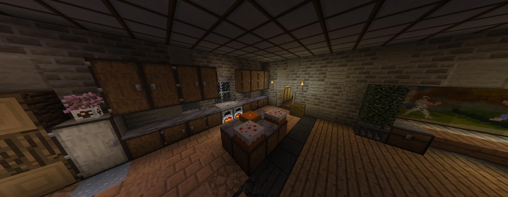
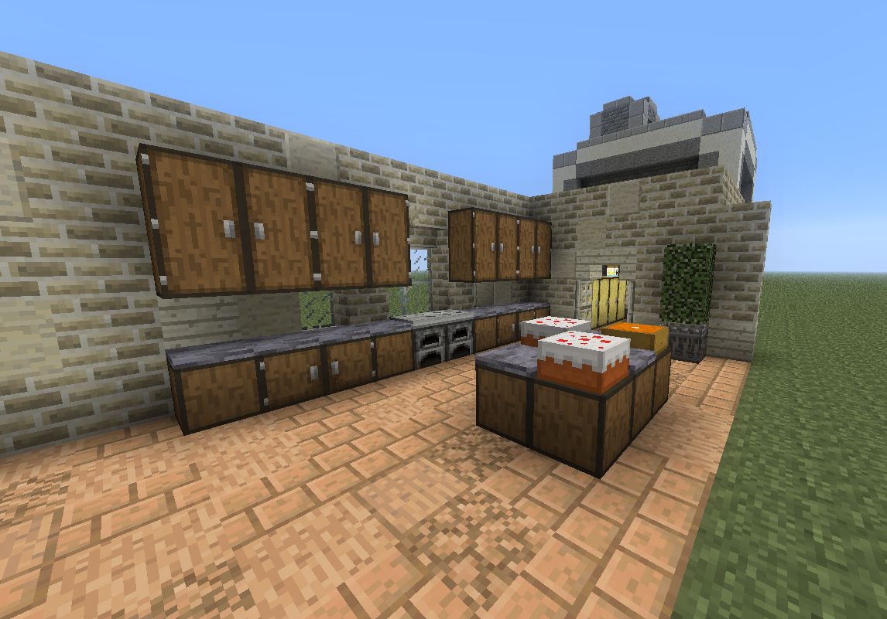
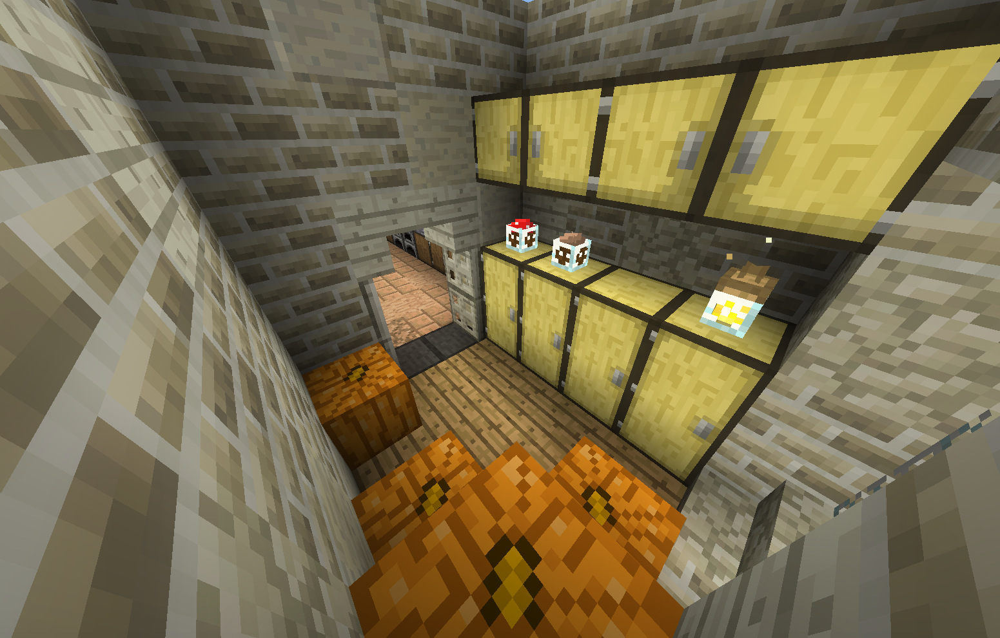
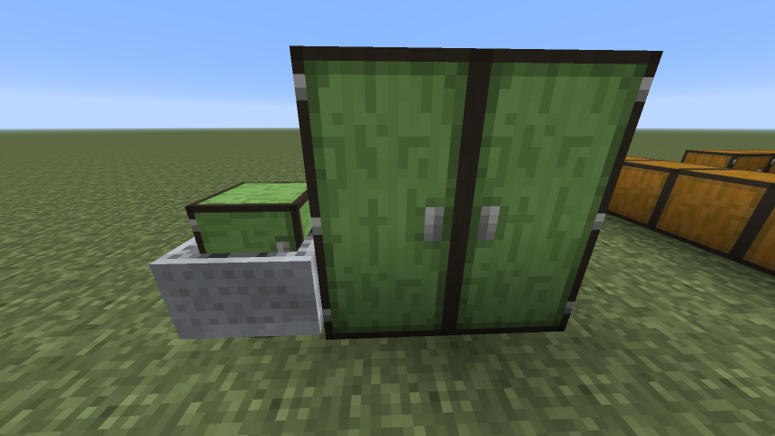

# BTA-Cupboards

*Unlike chests, cupboards connect vertically and mirrored like doors.*

Can be crafted by putting a single chest in the crafting slot and can be crafted back into the chest.

Idea and textures by Zainnhy

Requirements:

- BTA (https://www.betterthanadventure.net)
- Babric for BTA https://github.com/Turnip-Labs/babric-instance-repo/releases/tag/v7.3_01
- HalpLibe (https://github.com/Turnip-Labs/bta-halplibe)
